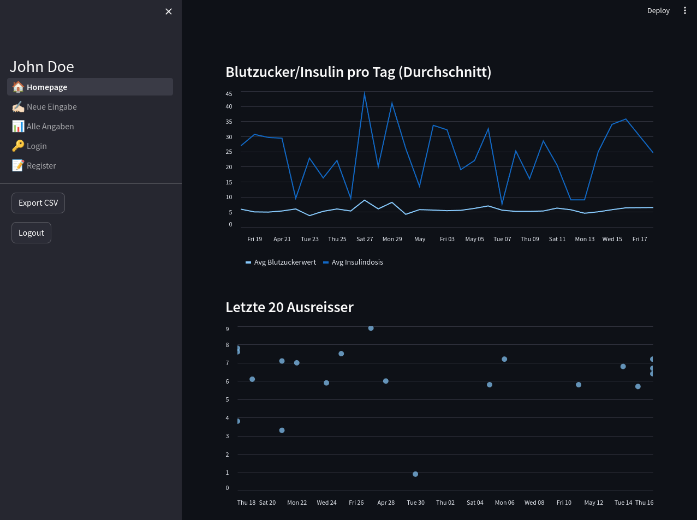

# JD_PROJECT_DIABETES_TYP_I
App für Leute mit Diabetes Typ I, die keine Insulin-Pumpe haben dürfen.
Tägliche Überwachung Blutzuckerwerte und Insulindosierung. Tägliche Kontrolle der Kohlenhydrataufnahme.
Die regelmässige Kontrolle des Blutzuckerspiegels und Insulingabe ermöglicht es, die Insulindosen besser anzupassen, um die Symptome der Krankheit zu lindern und die Lebensqualität zu verbessern. 
Die Idee ist die Werte grafisch darzustellen um diese besser interpretieren zu können.

### Entwicklungsumgebung
Für die Entwicklung erstellen Sie eine Datei unter `.streamlit/secrets.toml`.
```toml
[github]
owner="" # GitHub-Benutzername
repo="" # GitHub-Repository
token="" # GitHub-Personal Access Token
```


### Homepage Graph Beispiel
